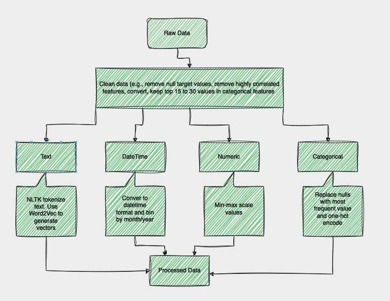
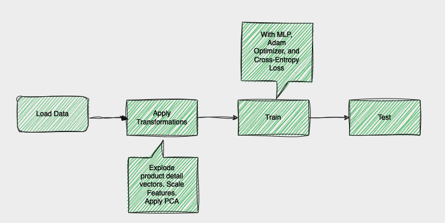

# ML Classification Coding Challenge Submission
Samra Kasim

## Set Up
* Using `python version 3.9`
* Create a virtual environment
* Run `pip install -r requirements.txt`
### If repo was downloaded from Google Drive:
* No need to download anything else. All files are in their respective directories.
### If repo was cloned from Github:
* Download *three* files from my shared Google Drive directory [here](https://drive.google.com/drive/folders/1i25VwvoiC0xY9Wo3Kxlhh3JNtiirRVyw?usp=sharing)
* Place `GoogleNews-vectors-negative300.bin.gz` vectors file in the `data` directory.
* If training and testing *without* generating processed data files from raw data, place `train.pk` and `validation.pk` in `munged_data`
* Place original challenge data files `ds-project-train.csv` and `ds-project-validation.csv` in the `data` directory

## Processing Raw Files
* In the `.env` file, update option for `IS_TRAIN`. If **train** file is processed, then `IS_TRAIN=True` and if **validation** file is processed, then `IS_TRAIN=False`
* Then in root, run `python3 generate_files.py`
* Generated processed files are located in `munged_data` directory. The training data is `train.pk` and validation data is `validation.pk`

## Training and Testing
It is possible to run training and testing without file generation as the necessary files are saved in `munged_data` directory. There are two options for training: 1) Jupyter Notebook and 2) Python Script
### Jupyter Notebook
* To the train and test the model with the processed train and test files, run `model_nn.ipynb` with Jupyter Notebook. 
* Install Jupyter Notebook with `pip install notebook`. Create a kernel for your virtual environment with `python -m ipykernel install --user --name=${virutal environment name}` and add it to the notebook.

### Python Script
* From root directory run `python3 train_nn.py`
* In `.env` update model training parameters as desired.
* Trained model is saved as `models/trained_model.pk`

## Demo
For the demo, I will use:
* `data_exploration_and_munging.ipynb` to demonstrate processing of raw data
*  `model_nn.ipynb` to demonstrate model training and testing

